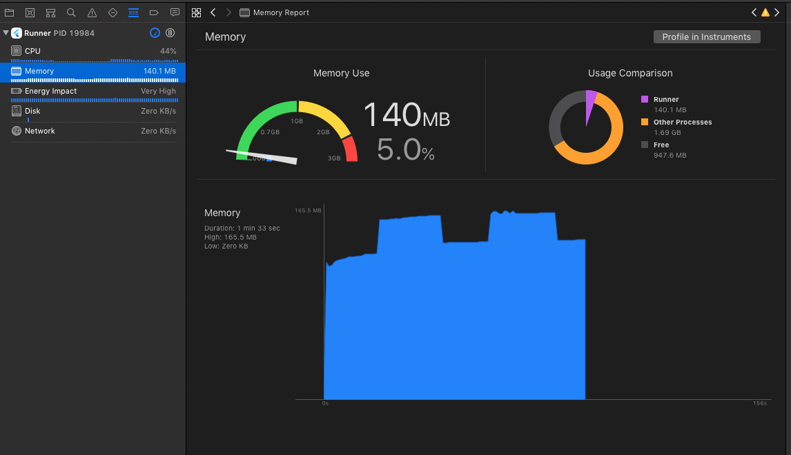

# flare_leak_investigation

Flutter+Flare investigation into high memory usage.

# App
The app displays a Flare widget with a looping animation. It also has a checkbox to toggle the dimensions of the widget. When it is checked, the widget is displayed at a large size (10x). When it is unchecked, it is displayed at a small size (0.25x). Note that the Flare animation is very light colored so it will be hard to make out on the screen, and is effectively invisible when checked.

Checking the checkbox causes memory usage to spike up. Unchecking it will let memory drop back down, after a few seconds.

We've seen a similar issue in Flare when monitoring the Skia resource [cache usage bytes](https://api.skia.org/classGrContext.html#ac1d4b739c9d7e2ef6e831bb73bb5ac76). As you can see [in this video](https://drive.google.com/file/d/1SkgcnzVQf4XnlaulXfKfzpWQoYvkd7SC/view) the cache usage spikes up when zoomed in and then lowers when zoomed out.
